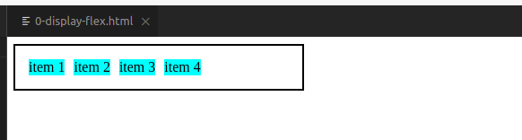

# DIO CSS flexbox - Profa. Karen Santos

* Fundamentos e aplicações da propriedade flexbox na criação de layouts responsivos, sem a necessidade da definição de valores fixos;

Construir páginas que vao se adaptar as mais variadas resoluções de tela sem precisar configurar/calcular cada valor para se adaptar;
        
####  Flex container: 

#### 2.1. Display Flex

Sugestões: no VScode adicionar as seguintes extensões: HTML Snippets e Live HTML Previewer;

Objetivos: Conhecer e aplicar a propriedade de inicia do flex container.
Torna a tag (div, span, section, h1, h2,...,a> ou qualquer que seja) um elemento do tipo Flex container, e assim automaticamente todos os seus filhos diretos desta tag, tornam-se em flex items.

Prática:

    Começar digitando hmtl e selecionar a linguagem já sai a estrutura básica para trabalhar, economiza tempo e ajuda quem ainda nao sabe exatamente o que fazer;

    Dica: div.item*3 ---> cria 3 tags do tipo div com a classe item que foi definida no style do CSS;   

    Display: flex ->> modifica para que o item tenha o tamanho de seu conteúdo, mas aparece algo que se chama vazamento, ou seja quanto mais itens você adicionar dentro do container, após um certo numero de items nao será mais possivel conter esses itens e então devemos corrigir...

