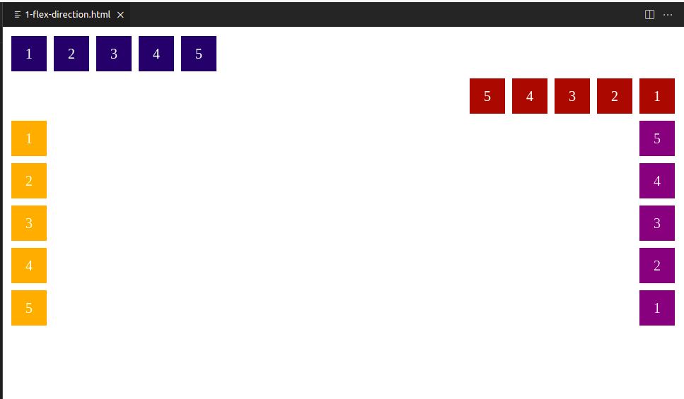

# DIO CSS flexbox - Profa. Karen Santos

* Fundamentos e aplicações da propriedade flexbox na criação de layouts responsivos, sem a necessidade da definição de valores fixos;

Construir páginas que vao se adaptar as mais variadas resoluções de tela sem precisar configurar/calcular cada valor para se adaptar;
        
####  Flex container: 

#### 2.2. Flex Direction

1. Entender o comportamento padrão de orientação horizontal de um flez container;

2. Aprender a modificar a orientação horizontal;

Propriedade que estabelece o eixo principal do container, definindo assim a direção que os flex items são colocados no flex container.

* *row (padrão):* a direção do texto, esquerda para a direita;

* *row-reverse:* sentido oposto da direção do texto;

* *collumn:* ordenação de cima para baixo em coluna única;

* *collumn-reverse:* ordenação inversa, de baixo para cima;

