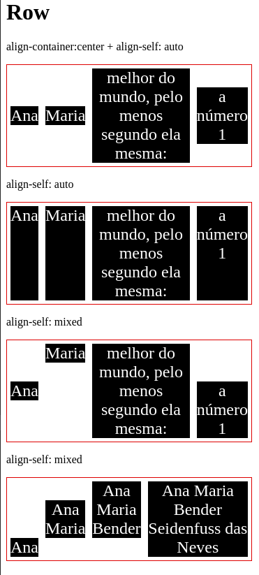
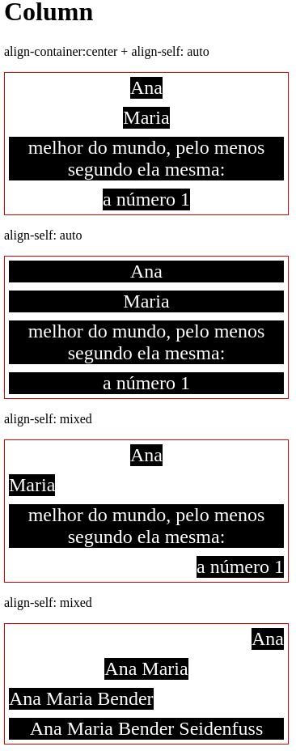

# DIO CSS flexbox - Profa. Karen Santos

* Fundamentos e aplicações da propriedade flexbox na criação de layouts responsivos, sem a necessidade da definição de valores fixos;

Construir páginas que vao se adaptar as mais variadas resoluções de tela sem precisar configurar/calcular cada valor para se adaptar;

#### Flex Item: 

#### 2.12 flex align-self

É a propriedade que estabelece o alinhamento de modo individual sobre um determinado item.

Valores possíveis:

* *auto:* valor padrão, irá respeitar a definição de align-items do container

* *flex-start:* ao início do container

* *flex-end:* ao final do container

* *center:* relativo ao centro de acordo com o eixo

* *stretch:* ocupa todo o espaço relativo

* *baseline:* utiliza a linha base da tipografia

