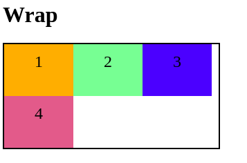

# DIO CSS flexbox - Profa. Karen Santos

* Fundamentos e aplicações da propriedade flexbox na criação de layouts responsivos, sem a necessidade da definição de valores fixos;

Construir páginas que vao se adaptar as mais variadas resoluções de tela sem precisar configurar/calcular cada valor para se adaptar;
        
####  Flex container: 

#### 2.3. Flex wrap

É a propriedade que define se os itens devem ou não quebrar a linha do nosso container;

Por padrão eles não quebram linhas, isso faz com que os flex itens sejam compactados além do limite do conteúdo;

Porém uma vez que os nossos containers nao consigam mais conter esses itens eles vão começar a vazar;

* *nowrap:* é o padrão, não permite a quebra de linha.

Duas situações:

1- em que eu tenho um container onde eu consigo que todos esses itens sejam comportados dentro dele;

2- em que um dos itens que já nao é mais comportado, entao eu começo a ter um problema de interface com elementos vazando;

* *wrap:* permite a quebra de linha assim que um dos flex itens nao puder mais ser compactado; Aqui nao temos mais o problema de vazamento mas passamos a ter com o espaçamento;

* *wrap-reverse:* permite a quebra de linha assim que um dos flex item nao puder mais ser compactado, porem na direção contrária da linha, acima;

direction: row (default)

direction: column

