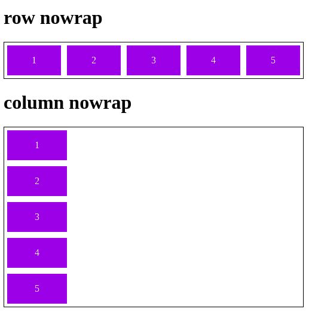
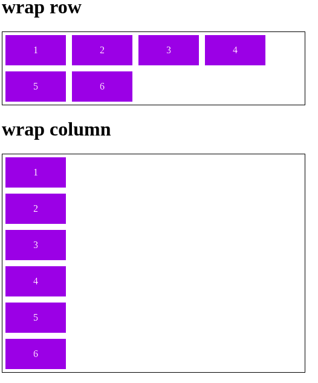
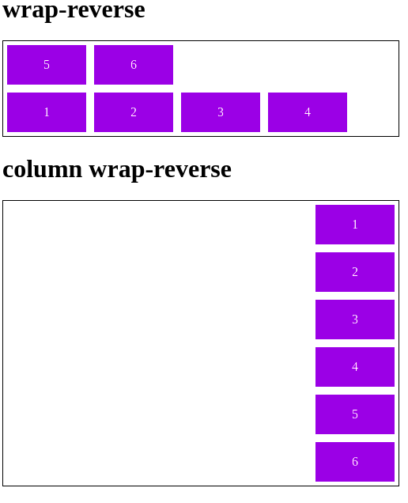
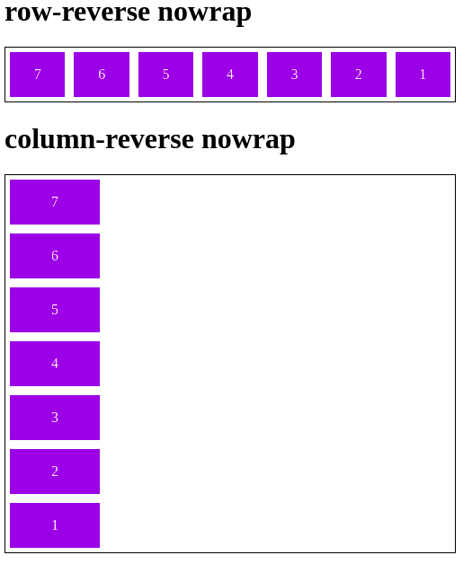
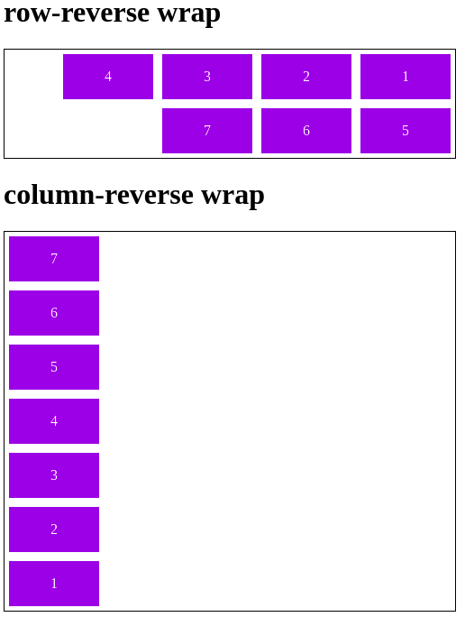
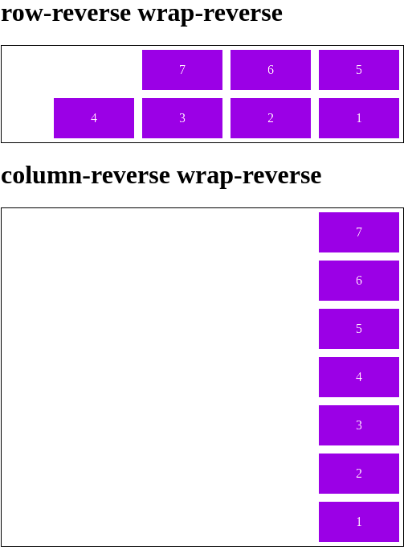

# DIO CSS flexbox - Profa. Karen Santos

* Fundamentos e aplicações da propriedade flexbox na criação de layouts responsivos, sem a necessidade da definição de valores fixos;

Construir páginas que vao se adaptar as mais variadas resoluções de tela sem precisar configurar/calcular cada valor para se adaptar;
        
####  Flex container: 

#### 2.4. Flex Flow

É um atalho para as propriedades flex-direction e flex-wrap.

Porém seu uso não é tão comum, isso porque quando mudamos o flex-direction para column, mantemos o padrão do flex-wrap que é nowrap.

