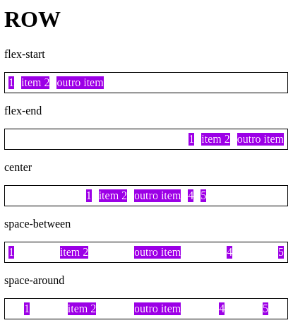
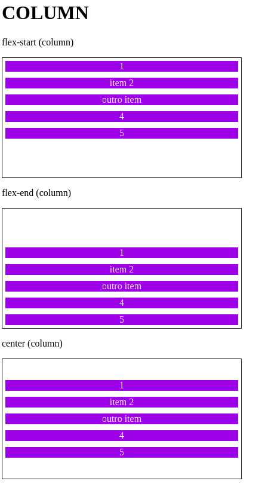
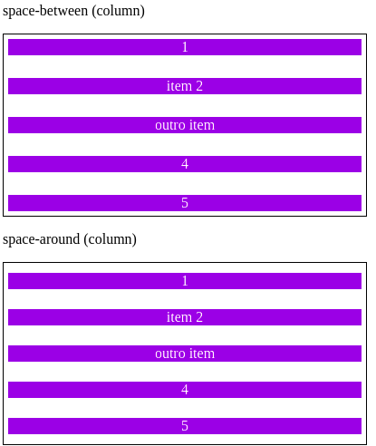

# DIO CSS flexbox - Profa. Karen Santos

* Fundamentos e aplicações da propriedade flexbox na criação de layouts responsivos, sem a necessidade da definição de valores fixos;

Construir páginas que vao se adaptar as mais variadas resoluções de tela sem precisar configurar/calcular cada valor para se adaptar;
        
####  Flex container: 
#### 2.5 Flex Justify Content

Essa propriedade vai se encarregar de alinhar os itens dentro do container de acordo com a direção pretendida e tratar da distribuição de espaçamento entre eles.

Caso tenhamos itens que ocupem 100% do container, essa propriedade não se aplica;

Variações:

* flex-start: início do container - 

* flex-end: final do container - levar todos os itens de acordo com a sobra de espaço para o final do container respeitando o limite do conteudo que esse item tem;

* flex-center: ao centro do container;

* flex-between: cria um espaço igual entre os elementos, porem o primeiro elemento a borda a esquerda; e o elemento final a borda a direita;

* space-around: os espaçamentos do meio são duas vezes maiores que o do final e inicial;

