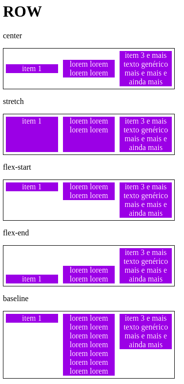
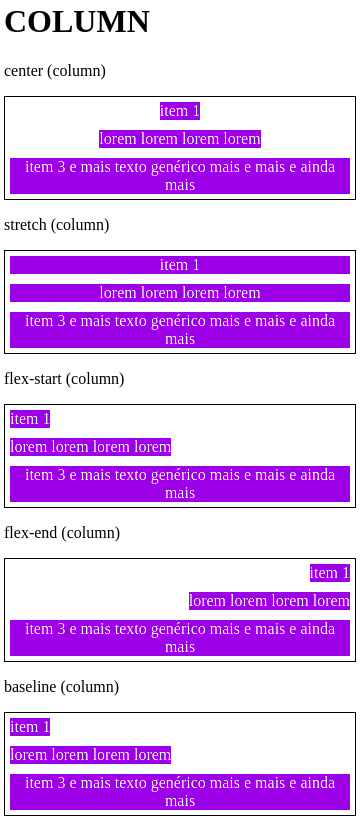
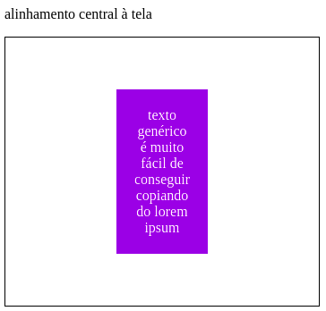

# DIO CSS flexbox - Profa. Karen Santos

* Fundamentos e aplicações da propriedade flexbox na criação de layouts responsivos, sem a necessidade da definição de valores fixos;

Construir páginas que vao se adaptar as mais variadas resoluções de tela sem precisar configurar/calcular cada valor para se adaptar;

####  Flex container: 

Tag que envolve os itens, será nela que iremos aplicar a propriedade "display: flex". Transforma todos os seus filhos em flex itens;

Essa inicialização de container pode ser feita em qualquer tipo de tag: div, span, h1, h2,..., a, por exemplo; 
    
#### 2.6 Flex Align Items

Trata do alinhamento dos flex itens de acordo com o eixo do container.

O alinhamento é diferente para quando os itens estão em colunas ou linhas.

Permite o alinhamento central no eixo vertical;

Tipos de alinhamento

* center: alinhamento dos itens ao centro;

* strech: padrão, e os flex itens crescem igualmente;

* flex-start: alinhamento dos itens no início;

* flex-end: alinhamento dos itens no final;

* baseline: alinhamentos de acordo com a linha base da tipografia dos itens.

