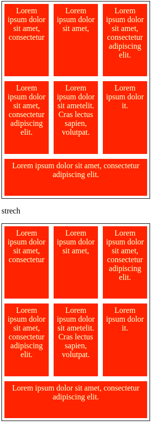
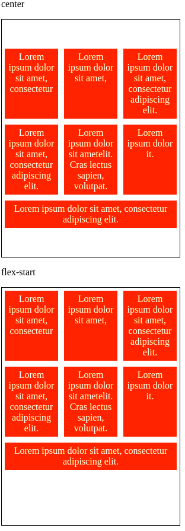
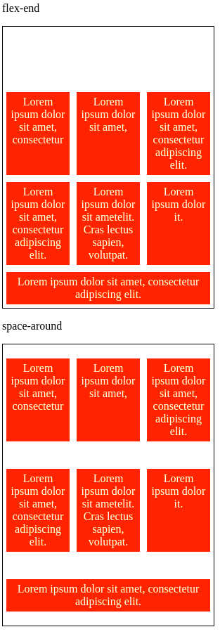
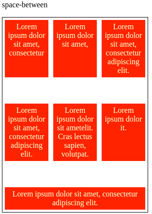

# DIO CSS flexbox - Profa. Karen Santos

* Fundamentos e aplicações da propriedade flexbox na criação de layouts responsivos, sem a necessidade da definição de valores fixos;

Construir páginas que vao se adaptar as mais variadas resoluções de tela sem precisar configurar/calcular cada valor para se adaptar;

####  Flex container: 

#### 2.7 Flex Align Content

É a propriedade responsável por tratar o alinhamento das linhas do container em relação ao eixo vertical do container.

Precisamos que:

* O container utilize quebra de linhas
* A altura do container seja maior que a soma das linhas dos itens

Tipos de alinhamento

* strech: padrão, e os flex itens crescem igualmente;

* center: alinhamento dos itens ao centro;

* flex-start: alinhamento dos itens no início;

* flex-end: alinhamento dos itens no final;

* space-between: espaçamento igual entre os elementos;

* space-around: ps espaçamentos do meio são duas vezes maiores que o inicial e final.

