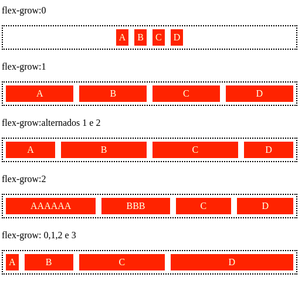

# DIO CSS flexbox - Profa. Karen Santos

* Fundamentos e aplicações da propriedade flexbox na criação de layouts responsivos, sem a necessidade da definição de valores fixos;

Construir páginas que vao se adaptar as mais variadas resoluções de tela sem precisar configurar/calcular cada valor para se adaptar;

#### Flex Item: 

#### 2.8 flex-grow

Define a proporcionalidade de crescimento dos itens, respeitando o tamanho de seus conteúdos internos.

Não funcionará se tivermos adicionado justify-content no nosso flex-container

