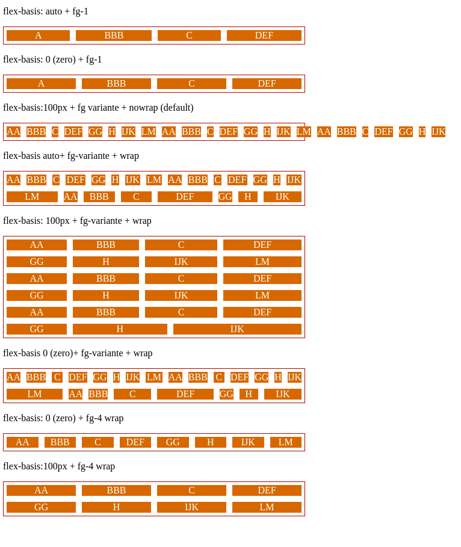

# DIO CSS flexbox - Profa. Karen Santos

* Fundamentos e aplicações da propriedade flexbox na criação de layouts responsivos, sem a necessidade da definição de valores fixos;

Construir páginas que vao se adaptar as mais variadas resoluções de tela sem precisar configurar/calcular cada valor para se adaptar;

#### 2.9 flex-basis

É a propriedade que estabelece o tamanho inicial do item antes das distribuições de espaço restante dentro dele, usando como base o conteúdo interno disposto;

valores (atributos da classe): 

* auto: caso o item nao tenha tamanho, este será proporcional ao conteudo do item;
* px, %, em, ...: são valores exatos previamente definidos;
* 0 (zero): terá relação com a definição do flex-grow.

